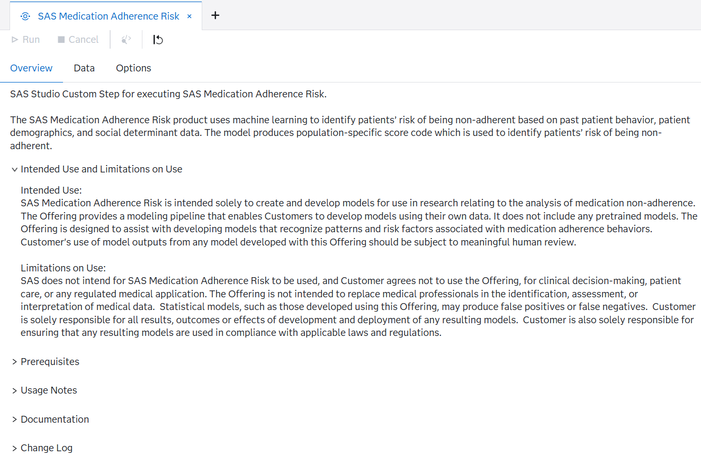
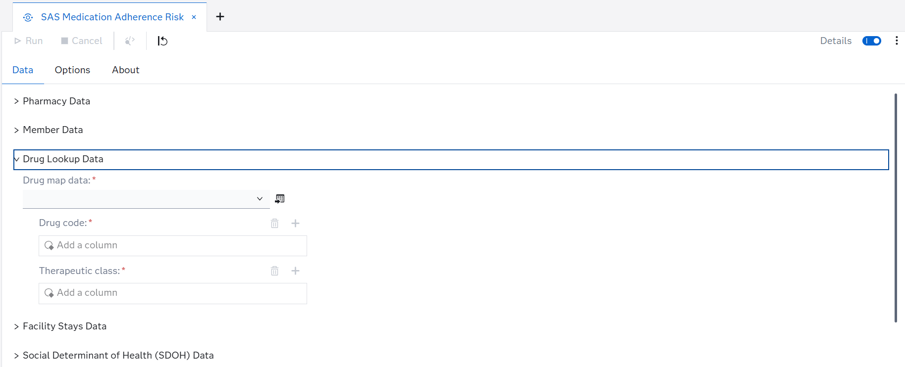
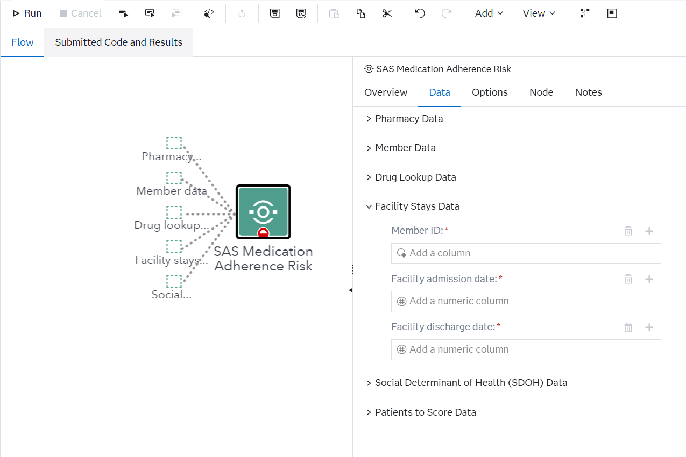
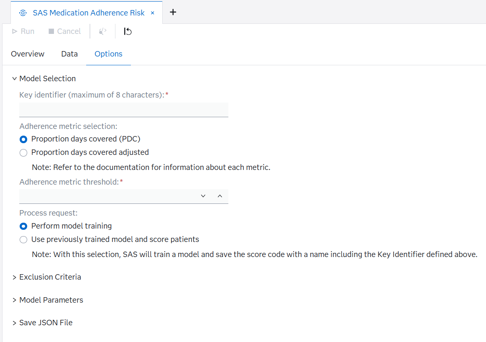

# SAAM - Medication Adherence Risk

## Description

>SAS Studio Custom Step for executing the SAS Medication Adherence Risk model pipeline. This custom step is provided to enable point-and-click usage of the SAS Medication Adherence Risk model pipeline offering from within the SAS Studio interface. 

## Usage Notes
>1. All data must exist in a SAS library
>2. Libraries must be defined prior to interacting with the Custom Step
>3. Certain variables that are used to join datasets must have consistent names across datasets in which they appear. Variables include: 
>   a. Member ID (exists in Pharmacy Claims, Member Information, Patients to Score, and Inpatient Stays)
>   b. Drug code (exists in Pharmacy Claims, Patients to Score, and Drug Look Up)
>   c. Drug class (exists in Pharmacy Claims and Drug Look Up)
>   d. Drug fill date (exists in Pharmacy Claims and Patients to Score)
>   e. Member state (exists in Member Information and SDOH Data)
>   f. Member county or zip code (exists in Member Information and SDOH Data)
>4. Patients to Score data and related data field inputs are required for scoring and are not used for model training. The fields 
    are only available when "Use previously trained model and score patients" is the selected process request. 
>5. When running the custom step in a flow, an input port must be added on the step node to connect the Patients to Score data. 

## Intended Use
>SAS Medication Adherence Risk is intended solely to create and develop models for use in research relating to the analysis of medication non-adherence. The Offering provides a modeling pipeline that enables Customers to develop models using their own data. It does not include any pretrained models. The Offering is designed to assist with developing models that recognize patterns and risk factors associated with medication adherence behaviors.  Customer's use of model outputs from any model developed with this Offering should be subject to meaningful human review.

## Limitations on Use
>SAS does not intend for SAS Medication Adherence Risk to be used, and Customer agrees not to use the Offering, for clinical decision-making, patient care, or any regulated medical application. The Offering is not intended to replace medical professionals in the identification, assessment, or interpretation of medical data.  Statistical models, such as those developed using this Offering, may produce false positives or false negatives.  Customer is solely responsible for all results, outcomes or effects of development and deployment of any resulting models.  Customer is also solely responsible for ensuring that any resulting models are used in compliance with applicable laws and regulations.

## User Interface

* ### Overview Tab ###

* ### Data Tab ###
>Data tab in stand alone custom step

>Data tab shown within a flow diagram

* ### Options Tab ###

## Requirements
> SAS Viya 2024.06 or later
> A license for Medication Adherence Risk is required 

## Settings
> For more information about the different settings please refer to the SAS documentation linked below. 

## Documentation 
* [SAS Medication Adherence Risk documentation] (https://go.documentation.sas.com/doc/en/aaimhpmacdc/v_001/aaimhpmawlcm/home.htm)

## Change Log
* Version 1.0 (26MAR2026) 
    * Initial version

